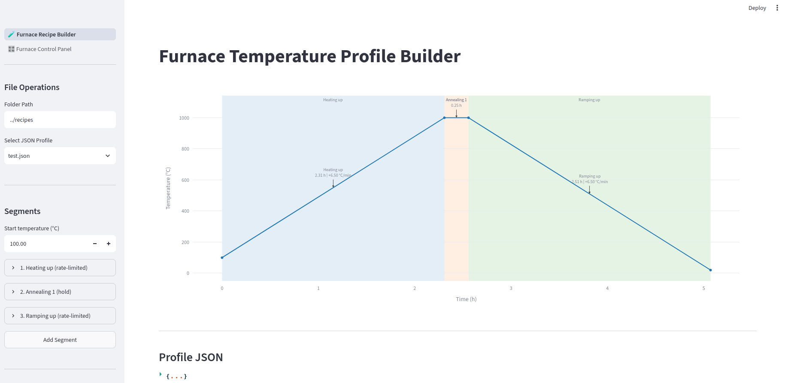
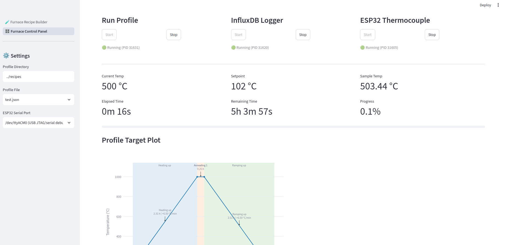
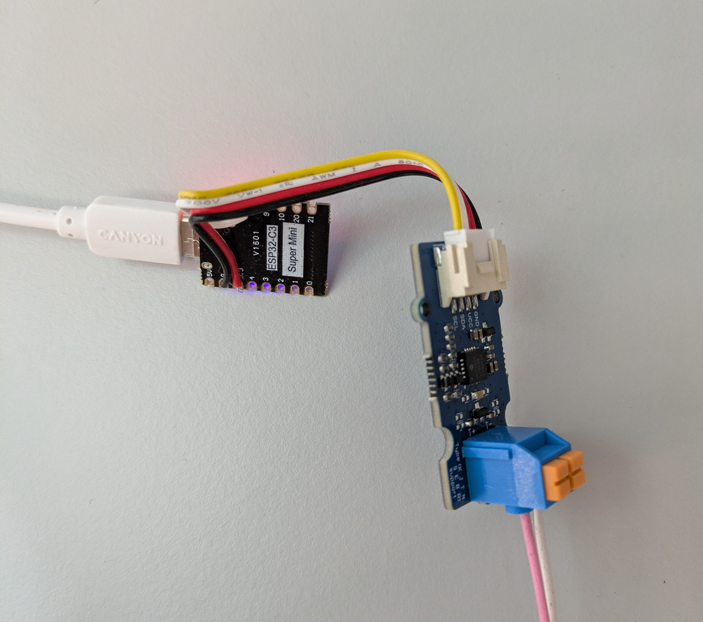

# Furnace Controller

A Streamlit web application to control a **Carbolite TS1-1200** tube furnace equipped with a Eurotherm 3016 controller over Ethernet.

## Features

* **Control:** Monitor and adjust furnace temperature in real time.
* **Recipes:** Run automated heating profiles loaded from JSON files.
* **Logging:** Record sample temperatures using an ESP32 with an MCP9600 thermocouple amplifier (Type N).
* **Dashboards:** Log time-series data to InfluxDB v2 for real-time Grafana visualization.

---


## Getting Started

### 1. Clone the Repository

```bash
git clone git@github.com:ThomasKressNMR/Furnace-Controller.git
cd Furnace-Controller

```

---

## Docker & Database Setup

### Prerequisites

1. Install [Docker](https://docs.docker.com/get-docker/).
2. *(Optional)* Install [Portainer CE](https://docs.portainer.io/start/install-ce/server/docker/linux) to manage Docker containers visually.

### Launch Containers

Start Grafana and InfluxDB:

```bash
cd docker
docker compose up -d

```

### InfluxDB Configuration

1. Open InfluxDB at `http://localhost:8086`.
2. Find the default `admin` password in the InfluxDB container logs (accessible via Portainer or `docker logs`).
3. Generate an API Token:
* Go to **API Tokens** > **Generate API Token**.
* Select **Read/Write** access for the `Furnace` bucket.


4. Paste the generated token into `./streamlit/.env`:
```env
INFLUX_TOKEN=your_generated_token_here

```


### Grafana Configuration

1. Open Grafana at `http://localhost:3000` (Default login: `admin` / `admin`).
2. Go to **Connections** > **Add new connection** > **InfluxDB** > **Add new data source**.
3. Configure the settings:
* **Query Language:** Flux
* **HTTP URL:** `http://influxdb:8086`
* **Basic Auth:** Disabled
* **Organization:** Forse
* **Default Bucket:** Furnace
* **Token:** Paste your InfluxDB API token.


4. Create a new dashboard panel using the following Flux query:

```flux
from(bucket: "Furnace")
  |> range(start: v.timeRangeStart, stop: v.timeRangeStop)
  |> filter(fn: (r) => r["_measurement"] == "TS1-1200")
  |> filter(fn: (r) => r["_field"] == "furnace_temperature" or r["_field"] == "furnace_setpoint" or r["_field"] == "sample_temperature")
  |> aggregateWindow(every: v.windowPeriod, fn: mean, createEmpty: false)
  |> yield(name: "mean")

```

---

## Network Configuration

Connect the Carbolite furnace directly to computer set your (or that of a ethernet to usb adapter) static IPv4 configuration:

* **IP Address:** `192.168.11.20`
* **Subnet Mask:** `255.255.0.0`

---

## Streamlit Application Setup

Using Conda:

```bash
# 1. Create and activate a Conda environment
conda create -n furnace python=3.14 -y
conda activate furnace

# 2. Install dependencies
pip install -r requirements.txt

# 3. Launch the app
cd streamlit
streamlit run main.py

```

---

## External Temperature Logging (ESP32)

### Hardware Required

* **Amplifier:** Seeed Studio Grove - I2C Thermocouple Amplifier (MCP9600)
* **Microcontroller:** ESP32 Development Board (e.g., ESP32-C3 Super Mini or ESP32-DEV-16P with USB-C)
* **Thermocouple:** RS PRO Type N Mineral Insulated Thermocouple (500mm length, 3mm diameter, max +1300°C)

### Wiring / Soldering


Cut the Grove cable in half and solder directly to the ESP32 header pins:

| Grove Wire Color | ESP32 Pin | Function       |
| --- |-----------|----------------|
| **Black** | `GND`     | Ground         |
| **Red** | `3V3`     | Power (+3.3V)  |
| **White** | `8`       | SDA: I2C Data  |
| **Yellow** | `9`       | SCL: I2C Clock |

### Firmware Flashing

1. Install [Arduino IDE](https://www.arduino.cc/en/software) (v2.3+).
2. Install the **esp32** board package by *Espressif Systems* via **Boards Manager**.
3. Install the [CP210x USB to UART Drivers](https://www.silabs.com/software-and-tools/usb-to-uart-bridge-vcp-drivers) if your computer doesn't recognize the board.
4. Tools > USB CDC on boot > Enabled
5. Open `arduino_temperature_logging/arduino_temperature_logging.ino` and upload it to your ESP32.
6. In the Streamlit app sidebar, select the matching serial port (labeled `UART` or `USB`).

---

## Quick Start / Daily Usage

1. Verify Docker containers are running (`docker ps`).
2. Activate environment and run Streamlit:
```bash
conda activate furnace
cd streamlit
streamlit run main.py
```
or more easily:
```
sh furnace_controller.sh
```
where `furnace_controller.sh` has been moved to `~/` and part in bracket has been modified to reflect folder structure